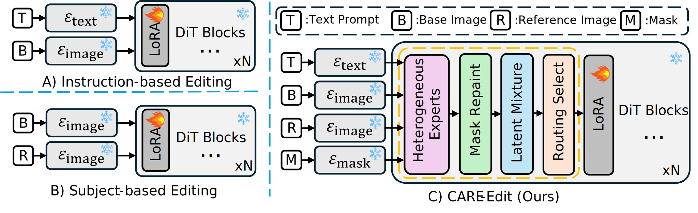
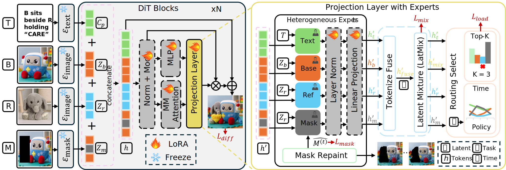
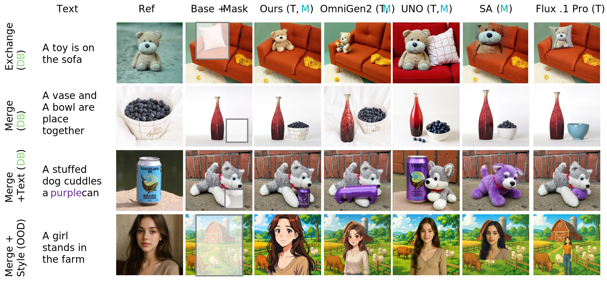

# CARE-Edit: Condition-Aware Routing of Experts for Contextual Image Editing (CVPR 2026)

### 🔥 Please star CARE-Edit ⭐ and share it. Thanks! 🔥

[Yucheng Wang*](https://wangandyyucheng.github.io/), [Zedong Wang*](https://jacky1128.github.io/), [Yuetong Wu](https://scholar.google.com/citations?user=Fjqr0fEAAAAJ&hl=zh-CN), [Yue Ma](https://mayuelala.github.io/), [Dan Xu†](https://www.danxurgb.net/)

**The Hong Kong University of Science and Technology (HKUST)**

[](#) [](https://wangandyyucheng.github.io/CARE-Edit/) [](#) [](#)

---

## 🚩 Updates

- ☑ Our **CARE-Edit** is accepted by **CVPR 2026**. The paper and codes will be released soon.

## 💡 Motivation

Existing unified diffusion editors suffer from task interference and cannot dynamically handle conflicting conditions, leading to color bleeding, identity drift, and unpredictable behavior. We propose **CARE-Edit** - a unified editor which routes diffusion tokens to **four specialized experts** via a lightweight **condition-aware router**.

<p align="center">
  
</p>

## 🔧 Framework

<p align="center">
  
</p>

**CARE-Edit** introduces condition-aware specialized experts within the frozen DiT backbone. Given multimodal conditions, inputs are tokenized and projected to **heterogeneous expert branches**. The router assigns confidence scores and selects the Top-K experts to process each token. Expert outputs are normalized, modulated, and fused through the **Latent Mixture** module, yielding denoised representations refined by **Mask Repaint** module.

## 🎨 Results

### Contextual Image Editing

<p align="center">
  
</p>

### Qualitative Comparisons

<p align="center">
  
</p>

## 🛠️ Getting Started

> **Code coming soon!** Stay tuned for the full release.

<!--
### Installation

```bash
git clone https://github.com/xxx/CARE-Edit.git
cd CARE-Edit
pip install -r requirements.txt
```

### Usage

```bash
python run.py --config configs/default.yaml
```
-->

## 📜 BibTeX

If CARE-Edit is helpful for your research, please cite:

```bibtex
@inproceedings{wang2026careedit,
  title={CARE-Edit: Condition-Aware Routing of Experts for Contextual Image Editing},
  author={Yucheng Wang and Zedong Wang and Yuetong Wu and Yue Ma and Dan Xu},
  booktitle={The IEEE/CVF Conference on Computer Vision and Pattern Recognition (CVPR)},
  year={2026}
}
```

## 📧 Contact

If you have any questions, please email **ywangls@connect.ust.hk**.

## 📜 Sincere Acknowledgement

Appreciate the following works for their great contributions:

- [**UNO**](https://bytedance.github.io/UNO/): Serves as the inspiration for our project.
- [**OmniControl**](https://github.com/): Foundational conditioning approaches that motivate our routing design.
